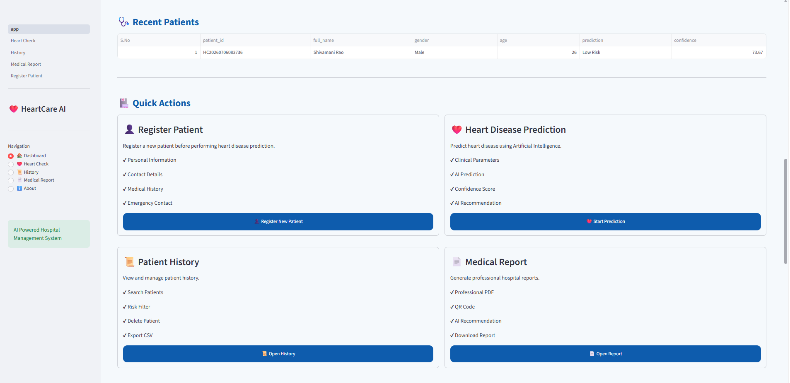
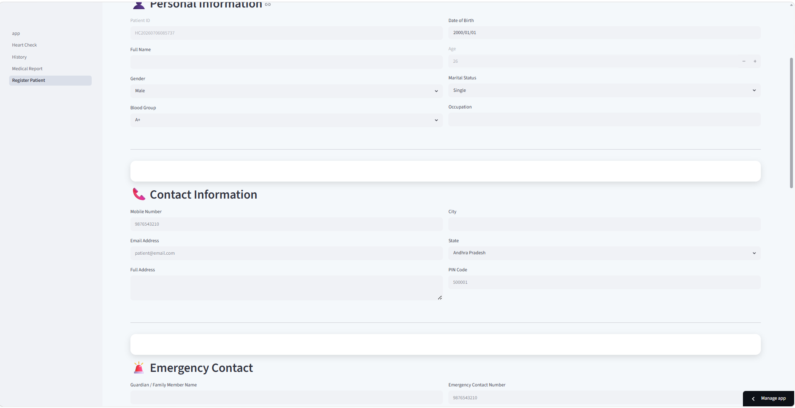
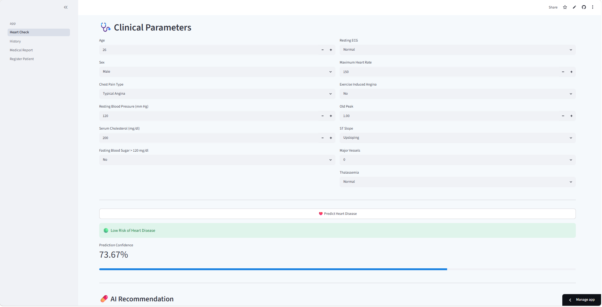
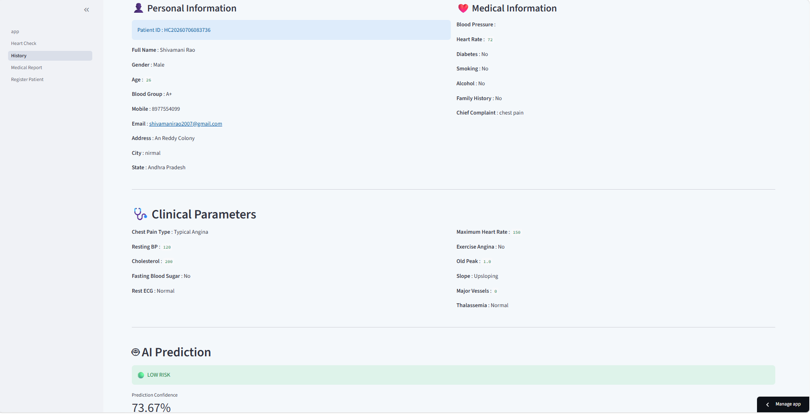
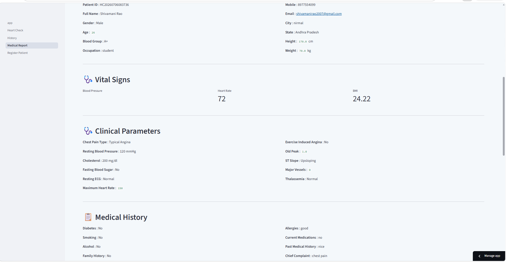
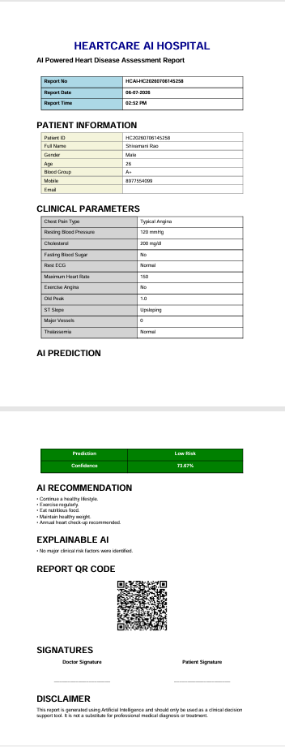

# ❤️ HeartCare AI

An AI-powered web application that predicts the risk of heart disease and helps manage patient records through an intuitive healthcare dashboard.

HeartCare AI combines Machine Learning with a simple web interface to assist in patient registration, heart disease prediction, record management, and medical report generation.

---

## 🚀 Live Demo

🔗 https://heartcare-ai-fxfgbhszqh458aymszdkbe.streamlit.app/

---

## 📌 About the Project

HeartCare AI was developed to demonstrate how Machine Learning can be integrated into a healthcare workflow.

The application allows healthcare professionals to:

- Register patient information
- Predict heart disease risk using AI
- Maintain patient records
- View patient history
- Generate downloadable PDF medical reports
- Export patient records as CSV files

---

## ✨ Key Features

- ❤️ AI-based Heart Disease Prediction
- 👤 Patient Registration System
- 📊 Patient History Dashboard
- 📄 PDF Medical Report Generation
- 📥 CSV Export
- 💾 SQLite Database Integration
- 🧠 Machine Learning Powered Prediction
- 📱 Clean and Interactive Streamlit Interface

---

## 🤖 Machine Learning

**Model:** Random Forest Classifier

**Dataset:** UCI Heart Disease Dataset

The prediction model analyzes multiple clinical parameters including:

- Age
- Sex
- Chest Pain Type
- Blood Pressure
- Cholesterol
- ECG Results
- Maximum Heart Rate
- Exercise-Induced Angina
- ST Depression (Oldpeak)
- Number of Major Vessels
- Thalassemia

The model predicts whether a patient is at **Low Risk** or **High Risk** of heart disease.

---

## 🛠️ Tech Stack

| Category | Technologies |
|----------|--------------|
| Programming | Python |
| Web Framework | Streamlit |
| Machine Learning | Scikit-learn |
| Data Processing | Pandas, NumPy |
| Database | SQLite |
| Report Generation | ReportLab |
| Visualization | Matplotlib |
| Explainable AI | SHAP |
| QR Code | qrcode |

---
## 📸 Application Preview

### 🏠 Dashboard

---

### 👤 Register Patient

---

### ❤️ Heart Disease Prediction

---

### 📊 Patient History

---

### 📄 Medical Report

---

### 📑 Generated PDF Report

## 🎯 Project Goal

The objective of this project is to demonstrate the end-to-end development of an AI-powered healthcare application by combining Machine Learning, database management, report generation, and an interactive web interface.

This project was built as part of my Machine Learning portfolio to showcase practical implementation skills in Python, Streamlit, and Scikit-learn.

---

## 👨‍💻 Developed By

**Shivamani Rao**

If you found this project useful, consider giving it a ⭐ on GitHub.
